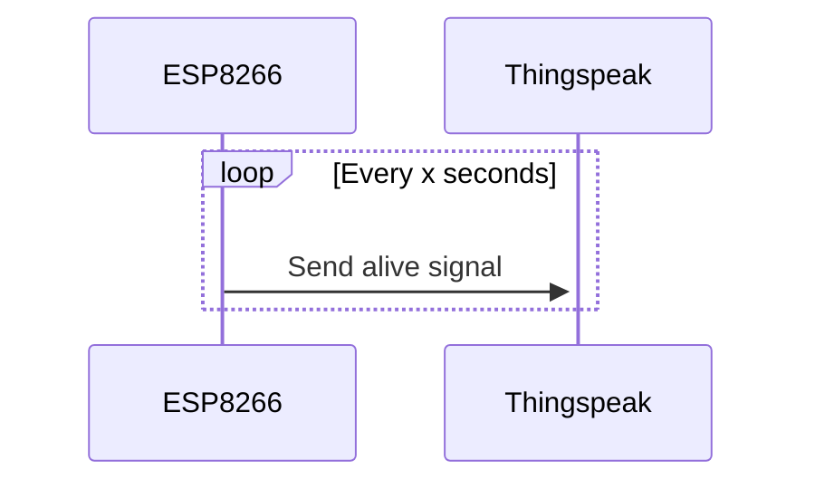
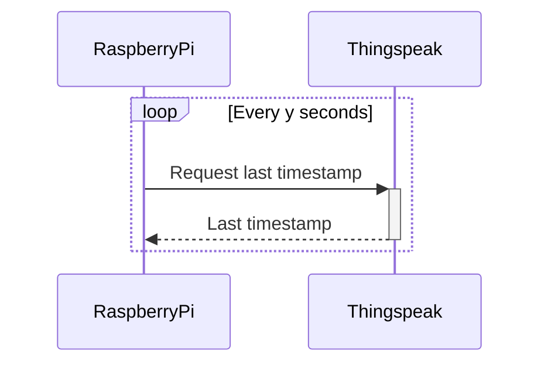
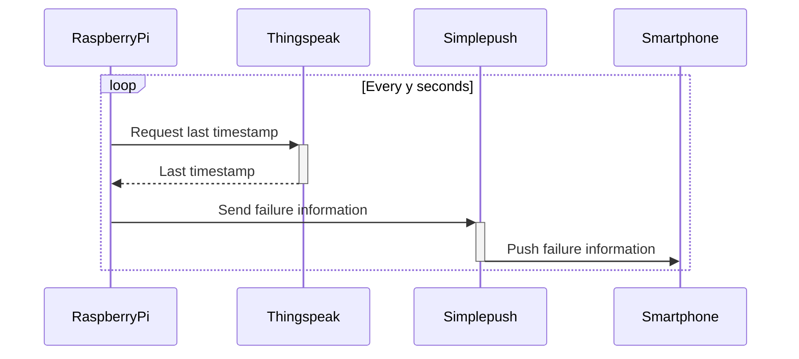

# Power Failure Monitoring
Monitoring power failures with an ESP8266, Thingspeak, RaspberryPi and Simplepush.

## Description
This project can be used to monitor the power supply to a remote target (e.g. house, cabin) that has WiFi.

I chose this setup because I already had Thingspeak in use, had a RaspberryPi server running, had some ESP8266s lying around, didn't want to buy a GSM setup and was quickly setup.

The ESP8266 needs to be at the target location to be monitored.
The RaspberryPi needs to be in a different location, such as your home.

The ESP8266 creates a new entry in the Thingspeak channel (alive counter) every x seconds.
The RaspberryPi checks every y minutes (cycle time) if the last entry in the Thingspeak channel is not older than z seconds (timeout).
If the entry is older, a push message is sent with Simplepush to inform you about the power failure.

Secrets are stored in secrets.py and secrets.h which have to be configured according to your settings.

**ESP8266 communication**

**ESP8266 communication [success]**

**ESP8266 communication [failure]**
